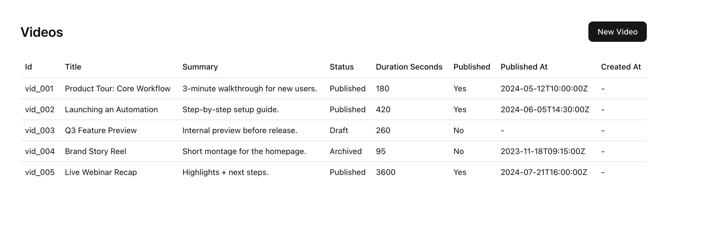

# SchemaCN

SchemaCN turns Prisma schemas into ready-to-use shadcn CRUD pages for Next.js App Router.



## Why

Indie devs ship CRUD apps every week. SchemaCN removes the glue work between schema, forms, tables, and pages.

## Features (MVP)

- Prisma schema input
- Next.js App Router output
- List, detail, create, and edit pages
- shadcn components + TanStack Table-ready structure
- Zod schemas for validation

## Quickstart

```bash
npx schemacn generate --schema ./prisma/schema.prisma --out ./
```

By default, SchemaCN writes pages and components to your app folder. Adjust output with `--out`.

## Config file

Create a `schemacn.json` in your app root (or pass `--config`):

```json
{
  "schema": "./prisma/schema.prisma",
  "out": ".",
  "skipAuth": true,
  "includeModels": ["Video", "Subscription"],
  "excludeModels": ["Session"],
  "force": false
}
```

SchemaCN looks for `schemacn.json` in `--config`, your `--out` directory, or the current working directory.
Paths in `schemacn.json` are resolved relative to the config file location.
If `schema` is set in the config, you can omit `--schema`.

## Requirements

The generated code expects these dependencies in your app:

- shadcn/ui components (`button`, `form`, `input`, `textarea`, `checkbox`, `select`, `table`)
- `react-hook-form`
- `@hookform/resolvers`
- `zod`

SchemaCN will also report any missing shadcn/ui components or npm deps after generation.

## CLI

```bash
schemacn generate \
  --schema ./prisma/schema.prisma \
  --out ./
```

Options:

- `--schema`: Path to Prisma schema file
- `--out`: Output directory (usually your app root)
- `--models`: Comma-separated list of models to generate (optional)
- `--config`: Path to `schemacn.json`
- `--include-auth`: Include auth models (`User`, `Account`, `Session`, `VerificationToken`)
- `--force`: Overwrite existing files

By default, auth models are skipped unless you pass `--include-auth` or explicitly list them with `--models`.

## Example

Schema:

```prisma
model Video {
  id        String   @id @default(cuid())
  title     String
  createdAt DateTime @default(now())
}
```

Output (paths):

```
app/videos/page.tsx
app/videos/new/page.tsx
app/videos/[id]/page.tsx
app/videos/[id]/edit/page.tsx
components/schemacn/video-form.tsx
components/schemacn/video-table.tsx
lib/schemacn/video.schema.ts
lib/schemacn/video.data.ts
```

## Output Structure

```
app/
  users/
    page.tsx
    new/page.tsx
    [id]/page.tsx
    [id]/edit/page.tsx
components/
  schemacn/
    user-form.tsx
    user-table.tsx
lib/
  schemacn/
    user.schema.ts
    user.data.ts
```

## Notes

- Data access is scaffolded. Swap in your own db calls.
- The generated code is plain React + shadcn. No runtime lock-in.

## License

MIT
